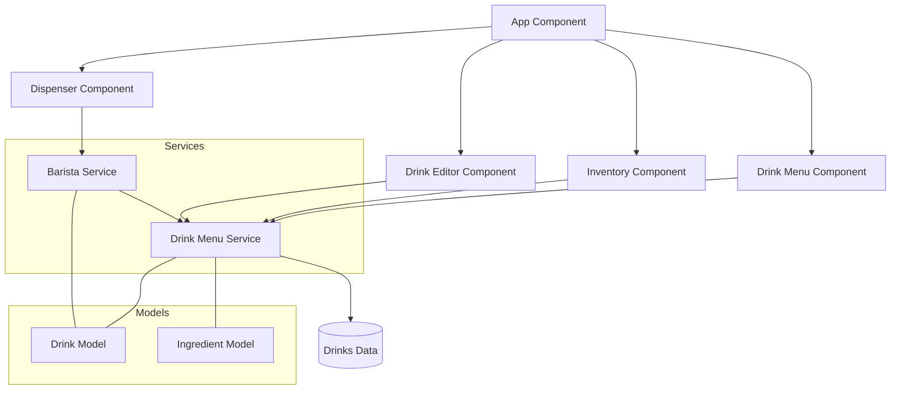

# Barista App

This professional coffee dispensing application was built with Angular 18.

## Features

- Interactive coffee dispensing interface with animations
- Inventory management system
- Custom drink creation and editing
- Real-time stock monitoring
- Responsive design for all device sizes

## Application Architecture



## Development server

Run `ng serve` for a dev server. Navigate to `http://localhost:4200/`. The application will automatically reload if you change any of the source files.

## Code scaffolding

Run `ng generate component component-name` to generate a new component. You can also use `ng generate directive|pipe|service|class|guard|interface|enum|module`.

## Build

Run `npm run build:prod` to build the project for production. The build artifacts will be stored in the `dist/` directory.

## Running unit tests

Run `ng test` to execute the unit tests via [Karma](https://karma-runner.github.io).
Run `npm run test:ci` to run tests in CI environment.

## Deployment

### Deploying with Docker

1. Build the Docker image:
   ```
   docker build -t barista-app .
   ```

2. Run the container:
   ```
   docker run -p 8080:80 barista-app
   ```

3. Access the application at `http://localhost:8080`

### Deploying to a Web Server

1. Build the project:
   ```
   npm run build:prod
   ```

2. Copy the contents of `dist/barista-app/browser` to your web server's root directory.

3. Configure the web server to redirect all requests to `index.html` (for SPA routing).
   - For Apache: Use the provided `.htaccess` file
   - For Nginx: Use the provided `nginx.conf` file
   - For IIS: Use the provided `web.config` file

### Deploying to GitHub Pages

1. Install the gh-pages package:
   ```
   npm install -g angular-cli-ghpages
   ```

2. Build and deploy:
   ```
   ng build --configuration production --base-href="https://USERNAME.github.io/REPOSITORY_NAME/"
   npx angular-cli-ghpages --dir=dist/barista-app/browser
   ```

## Environment Configuration

The application uses environment-specific configuration files:
- `environment.ts` for development
- `environment.prod.ts` for production

## Service Worker and PWA Support

This application supports offline functionality through Angular's Service Worker. The service worker is only active in production builds.

## Further help

To get more help on the Angular CLI use `ng help` or go check out the [Angular CLI Overview and Command Reference](https://angular.dev/tools/cli) page.
